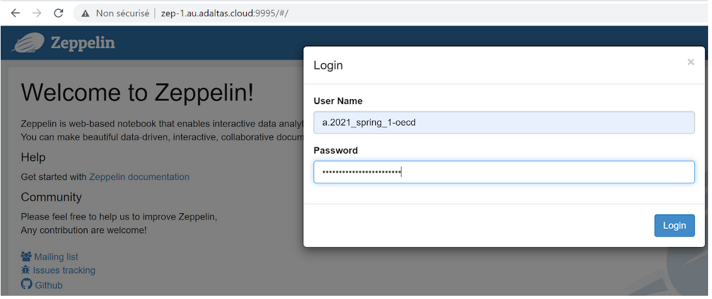
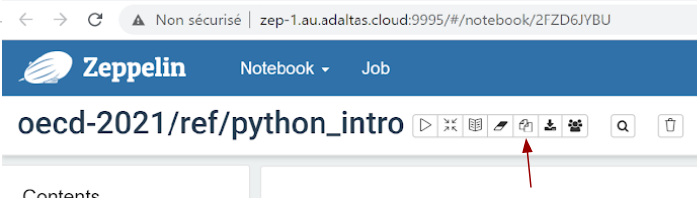

## Introduction to Python
### Demo and exercises

1. Prerequisites

Connect to the Adaltas cloud cluster using OpenVPN. Follow the tutorials:
- https://www.adaltas.cloud/en/docs/onboarding/vpn/
- https://www.adaltas.cloud/en/docs/onboarding/ssh/

2. Goals

Learn the Python fundamentals:
- Variables and data structures,  
- For and while loop
- Conditional statements
- Defining functions

3. Connection to Zeppelin

- Navigate to http://zep-1.au.adaltas.cloud:9995 with your browser
- Login using your Adaltas cloud credentials

- In the folder `oecd-2021/ref`, navigate to the `python_intro` notebook.
- Create a copy of the note  (by using the **Clone this note** button)

- Name the copy as follows: `oecd-2021/firstname-lastname/python_intro`
(e.g. `oecd-2021/petra-kaferle/python_intro`). This should create your folder in `oecd-2021/`.
- Initialize your interpreter by running `%pyspark` in  the first cell.

4. During the session

During the classes, go through the notebook and test the code along with the teacher. At the end, you will do exercises independently, with the help of the demo code.

5. Resources

- [Python documentation](https://docs.python.org/2.7/tutorial/index.html)
- [w3school](https://www.w3schools.com/python/default.asp) 
